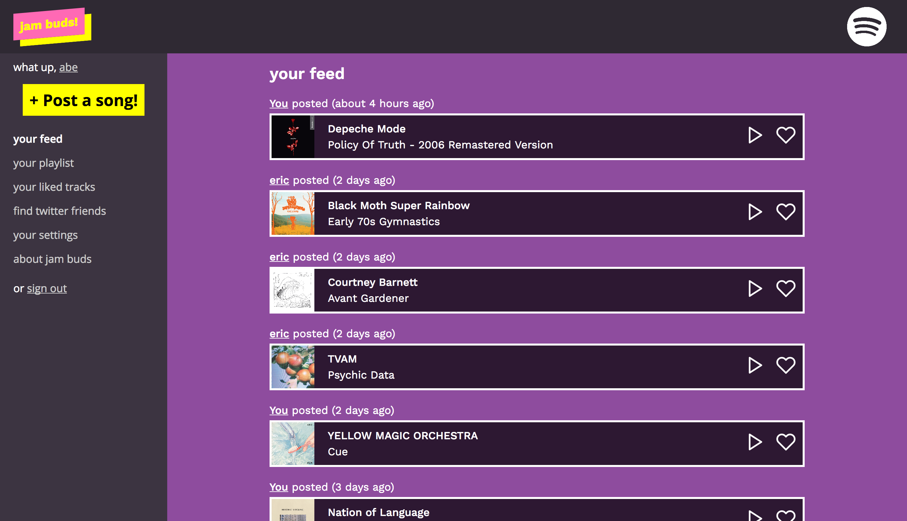
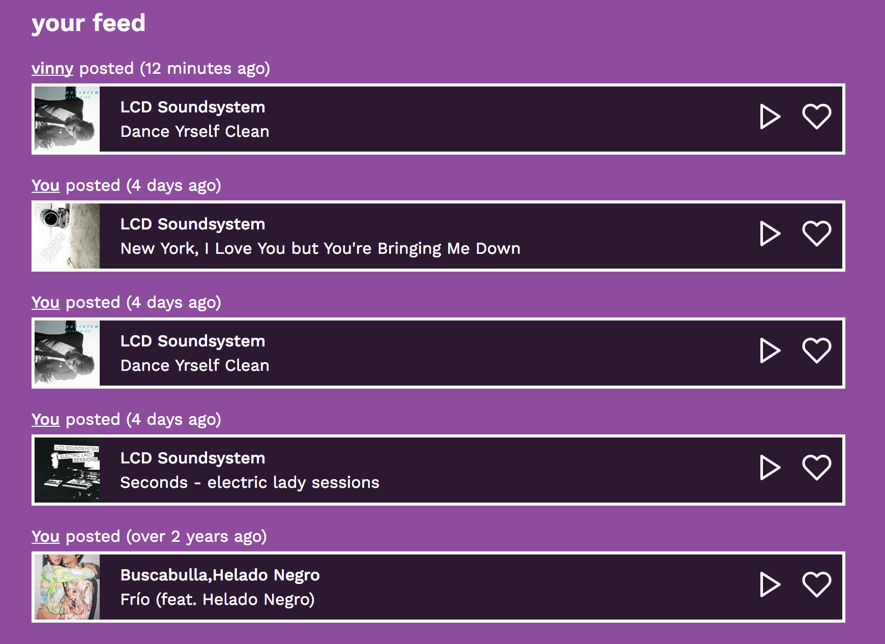
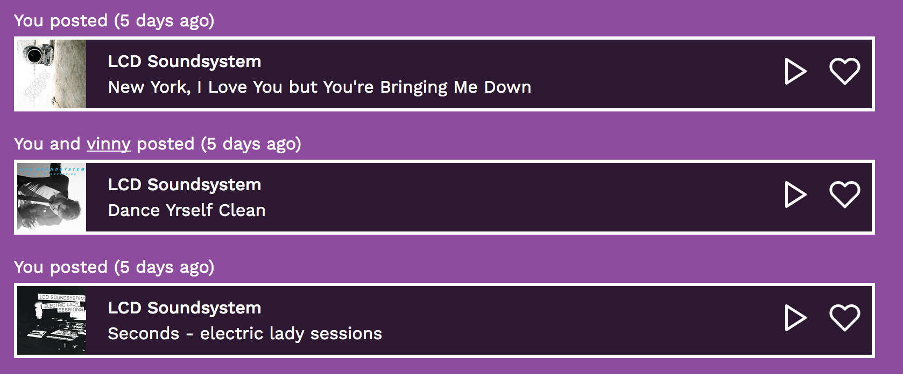

I've been working on [Jam Buds](https://jambuds.club/), a social network for sharing music you like, on and off for the past few years. Jam Buds's main feature is a feed of new music your friends have posted. The core idea is that (eventually) your feed will act as a smart "playlist," which you can listen back to at your leisure, more easily than tracking down songs your friends have posted on Twitter or Facebook.



One of the expected use patterns of Jam Buds is that when hot new releases come out, various users will immediately post them to their Jam Buds feed. When this happens at scale, it means that users may find their feed flooded with users posting the same songs.



This has a few problems:

- Most obviously, a user's feed gets flooded with the same song
- The "playlist" concept is kinda destroyed if you're repeatedly running into the same songs
- There's awkward duplication when you're interacting with songs - "liking" one entry in this feed will also mark the other one as liked.

To solve this, *Jam Buds prevents the same song from appearing more than once in a user's feed*.

## Implementation

When a user posts a song to Jam Buds, we create a row in the `posts` table mapping their `user_id` to the `song_id`. A song has its own normalized entry in a `songs` table. Originally, the feed was simply iterating over all of the *posts* the current user's followed users had made.

Now, to solve duplicate songs, we *aggregate* posts that are about the same song in a user's feed. We handle this the same way Twitter handles retweets:

- The *earliest chronological appearance* of a song in a user's feed is its canonical placement. (with one exception, see below)
- When additional users in a feed post a song, their names should be aggregated into a single entry, e.g. "You, Jeff, and Vinny posted"

Doing this as a query is kind of tricky, but seems to work:

```sql
-- This is going over _all_ songs, but in practice filters down to songs
-- posted by the specific user's followed users.
SELECT
  songs.*,
  MIN(posts.created_at) as earliest_posted,
  array_agg(users.name) as user_names
FROM songs
JOIN posts ON songs.id=posts.song_id
JOIN users ON users.id=posts.user_id
GROUP BY songs.id
ORDER BY earliest_posted DESC;
```

A few frontend tweaks (and a whole lot of API refactoring) later, and we've got our desired UX in the feed:



## Special Cases for Self-Posts

One tricky problem with feed aggregation is handling a user's own posts. Basically, if three of my friends have posted a song, and then I post a song, what happens in my feed?

Without any special cases, there's a couple problems that could arise:

- I would expect that, when I post a song, it would show up at the very top of my feed. However, with the way aggregation works, a song that's already been posted could show up updated somewhere in the middle.
- If I am posting a song that has already been posted in my feed by someone, like, several years and thousands of feed entries ago, it would never show up in my recent feed!

The special case to solve these problems is that, rather than just getting the earliest posted time of a song as shown above, we instead *prioritize the user's own post* of a song if it exists. This has several good outcomes:

- New posts *always* show up at the very top of your feed. This is not only great for ensuring users see the post, but also allowing the frontend to optimistically push the song to the top of your feed when you post it, without an actual feed refresh.
- When you return to your feed later, your own post will be "right where you left it," rather than buried based on someone else's original post date.

To handle this, we use a neat Postgres function called `COALESCE()`. This function takes multiple values, and returns the first non-null value from left to right. Thus, our query becomes more complicated:

```sql
-- Again, this will include _all_ songs, for a simpler query.
SELECT
  songs.*,
  COALESCE(
    (
      SELECT posts.created_at
      FROM posts
      WHERE user_id=?
        AND song_id=songs.id
    ),
    MIN(posts.created_at)
  ) as feed_timestamp,
  array_agg(users.name) as user_names
FROM songs
JOIN posts ON songs.id=posts.song_id
JOIN users ON users.id=posts.user_id
GROUP BY songs.id
ORDER BY feed_timestamp DESC;
```

`feed_timestamp` will now either be the time *you* made a post, *or* the earliest time someone you followed posted it.

Now, I don't expect too much from the performance of this query - from little what I know, the performance of a subquery like this can be kind of nasty, since you're relying on the Postgres query planner to turn "iterate over all the things again" into something more performant.

There might be better ways to write this out, but in practice, the query is already even more complex than is here (as a feed has to be filtered to a user's followed users, and a few extra fields are added), so I feel that this is an okay balance of query readability and performance.

## Follow-ups

There are several follow-up tasks to consider here:

- **Caching.** As I said, I expect the performance of this to be pretty gnarly, and some sort of caching would be great. I started to write out the specifics of what this would look like, and it got very difficult to reason about fast, so I think I'm going to punt on it. The hard part is figuring out what *updates* look like in a cached world - it's basically a cache-busting problem, as most things tend to be.
- **Time-boxed aggregation**. I think there should be some time period where songs *are* allowed to be duplicated in the feed - basically, after six months since the last time a song was posted, a new entry should be created. I believe Twitter does this (or has done this) with retweets, for example. This seems like a really hard query to write, though, and won't be an issue for Jam Buds until it's been running for a long time.